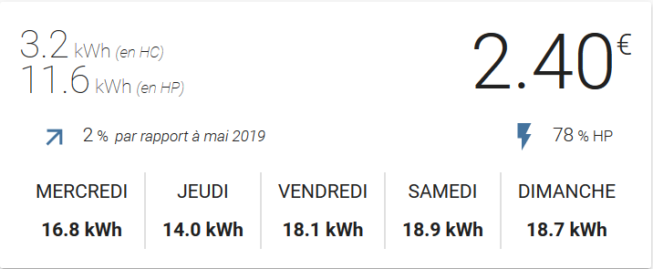
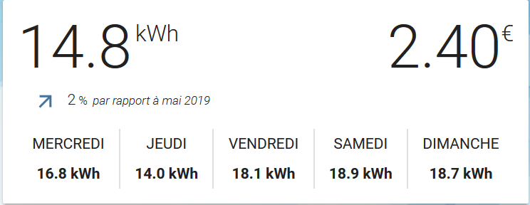
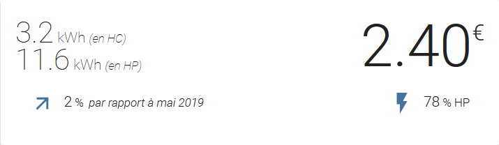

# Linky card

A custom [Lovelace](https://www.home-assistant.io/lovelace/) component for displaying linky info for [Home Assistant](https://github.com/home-assistant/home-assistant).

**Warning**: this card use a custom integration of Linky and not the default version of Home Assistant. You can see how to install and get the custom integration files from [@SeByDocKy youtube video](https://www.youtube.com/watch?v=QN0utSO_n98)

The card is initialy based on the work of [@Imbuzi](https://github.com/Imbuzi). I convert it to Lit Element and add some configuration option.



[](/LICENSE)

## Installation

### HACS

This card is not yet available in [HACS](https://hacs.xyz/) (Home Assistant Community Store) but can be added as custom repository in the settings tab.

### Manual

Download the linky-card.js from the latest release and store it in your configuration/www folder.
Configure Lovelace to load the card:

```yaml
resources:
  - url: /local/linky-card.js?v=1
    type: module
```

## Using the card

### Options

#### Card options

| Name            | Type    | Required     | Since | Default | Description |
| --------------- | ------- | ------------ | ----- | ------- | ------------|
| type            | string  | **required** | v0.1  | `custom:linky-card` |    |
| entity          | string  | **required** | v0.1  |         | The linky sensor entity_id. |
| showHistory     | bool    | optional     | v0.1  | true    | Display History |
| showPeakOffPeak | bool    | optional     | v0.1  | true    | Activate Peak(heure pleine) and OffPeak mode (heures creuses) |

### Example usage

Default config

```yaml
type: "custom:linky-card"
entity: sensor.linky
```


Example with Peak OffPeak hour disabled

```yaml
type: "custom:linky-card"
entity: sensor.linky
showPeakOffPeak: false
```



Example with no history

```yaml
type: "custom:linky-card"
entity: sensor.linky
showHistory: false
```


